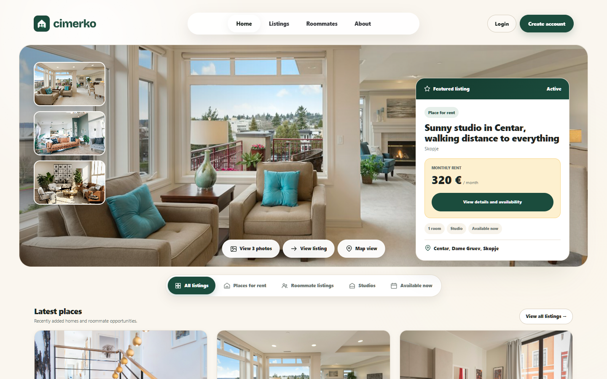
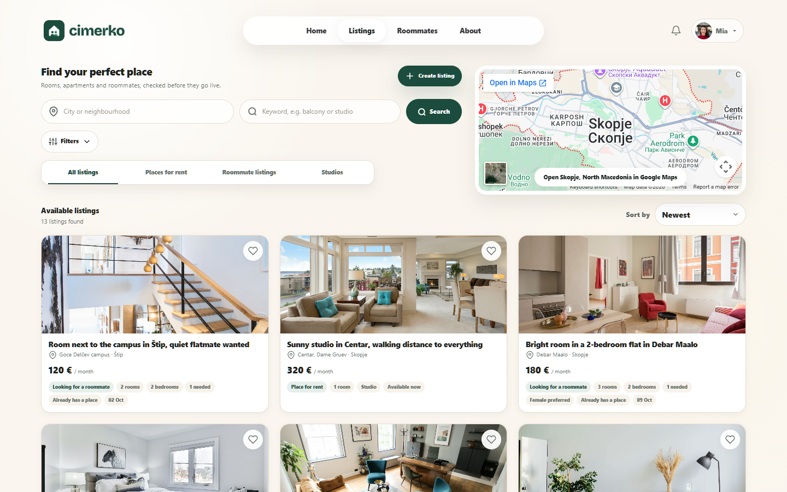
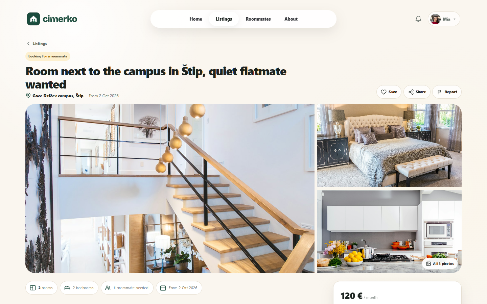
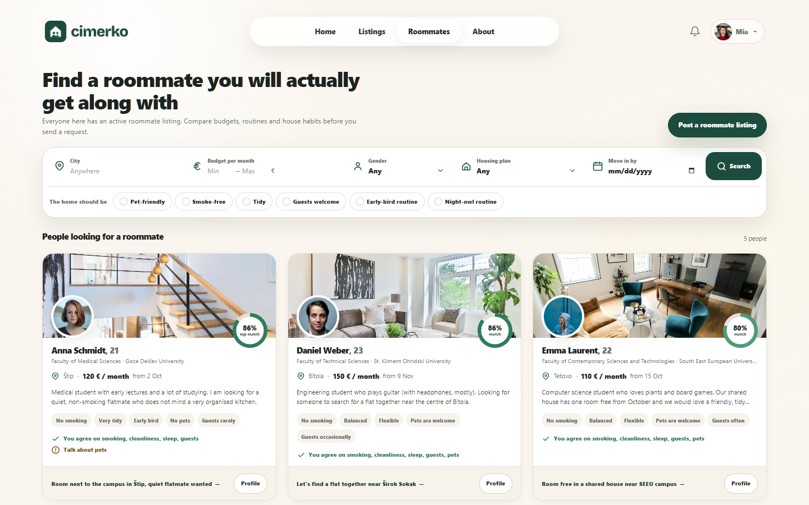

# Cimerko

Cimerko is a web application for finding a place to live and the people to share it with. Landlords publish rooms and apartments, and people looking for housing can browse listings, send requests and find compatible roommates.



## Features

- **Listings** - create, edit and close room and apartment listings with photos
- **Search and filtering** - filter by city, budget, bedrooms and lifestyle preferences, and save searches for alerts
- **Roommate matching** - roommate profiles with a compatibility score between users
- **Listing requests** - request a listing and let the owner accept or decline
- **Saved listings** - bookmark listings to come back to later
- **Reviews and reports** - review listings and report inappropriate content
- **Notifications** - in-app notifications for requests and saved search matches
- **Roles** - separate Student, Landlord and Admin roles via ASP.NET Core Identity
- **Admin panel** - approve listings, block users and handle reports

## Screenshots

| Listings                                        | Listing details                                        |
| ----------------------------------------------- | ------------------------------------------------------ |
|       |  |



## Tech stack

| Area           | Technology                         |
| -------------- | ---------------------------------- |
| Framework      | ASP.NET Core MVC (.NET 10)         |
| Language       | C#                                 |
| Data access    | Entity Framework Core              |
| Database       | SQLite                             |
| Authentication | ASP.NET Core Identity              |
| UI             | Razor views, Bootstrap, custom CSS |
| Testing        | xUnit, Moq                         |
| Deployment     | Docker                             |

## Project structure

```text
cimerko-app/
├── cimerko-app/          Web application
│   ├── Areas/Identity/   Identity pages (login, register, account)
│   ├── Controllers/      MVC controllers
│   ├── Data/             DbContext, migrations and seed data
│   ├── Models/           Entities, enums and view models
│   ├── Services/         Business logic (search, notifications, storage, email)
│   ├── ViewComponents/
│   ├── Views/            Razor views
│   ├── wwwroot/          Static files and uploaded images
│   └── Dockerfile
├── docs/screenshots/     README screenshots
└── Tests/                xUnit test project
```

## Getting started

### Prerequisites

- [.NET 10 SDK](https://dotnet.microsoft.com/download)
- EF Core CLI tools: `dotnet tool install --global dotnet-ef`

### Run locally

```bash
git clone https://github.com/asanaliov/cimerko-app.git
cd cimerko-app/cimerko-app
dotnet restore
dotnet ef database update
dotnet run
```

The app runs at `https://localhost:7221` (or `http://localhost:5201`).

### Demo data

On first start the app seeds demo users, listings with photos and reviews. Every demo account uses the password `Demo123!`, for example:

| Role     | Email                         |
| -------- | ----------------------------- |
| Student  | `mia.thompson@cimerko.local`  |
| Landlord | `mark.johnson@cimerko.local`  |

Set `"SeedDemoData": false` in `appsettings.json` to disable seeding.

## Configuration

Settings live in `cimerko-app/appsettings.json` and can be overridden with environment variables (e.g. `ConnectionStrings__DefaultConnection`).

| Key                                   | Description                                   | Default                             |
| ------------------------------------- | --------------------------------------------- | ----------------------------------- |
| `ConnectionStrings:DefaultConnection` | SQLite connection string                      | `DataSource=app.db;Cache=Shared`    |
| `SeedDemoData`                        | Seed demo users and listings on startup       | `true`                              |
| `Email:Host`                          | SMTP host; if empty, emails are logged instead | empty                               |
| `Email:Port`                          | SMTP port                                     | `587`                               |
| `Email:EnableSsl`                     | Use SSL for SMTP                              | `true`                              |
| `Email:UserName` / `Email:Password`   | SMTP credentials                              | empty                               |
| `Email:From`                          | Sender address                                | falls back to `Email:UserName`      |

Keep real SMTP credentials out of source control by using [user secrets](https://learn.microsoft.com/aspnet/core/security/app-secrets) or environment variables.

## Running tests

From the repository root:

```bash
dotnet test
```

## Docker

```bash
cd cimerko-app
docker build -t cimerko .
docker run -p 10000:10000 cimerko
```

The container listens on port `10000`. The database must be migrated before the app starts, since migrations are not applied automatically.

## License

This project is licensed under the [MIT License](LICENSE).

## Author

Asan Aliov
